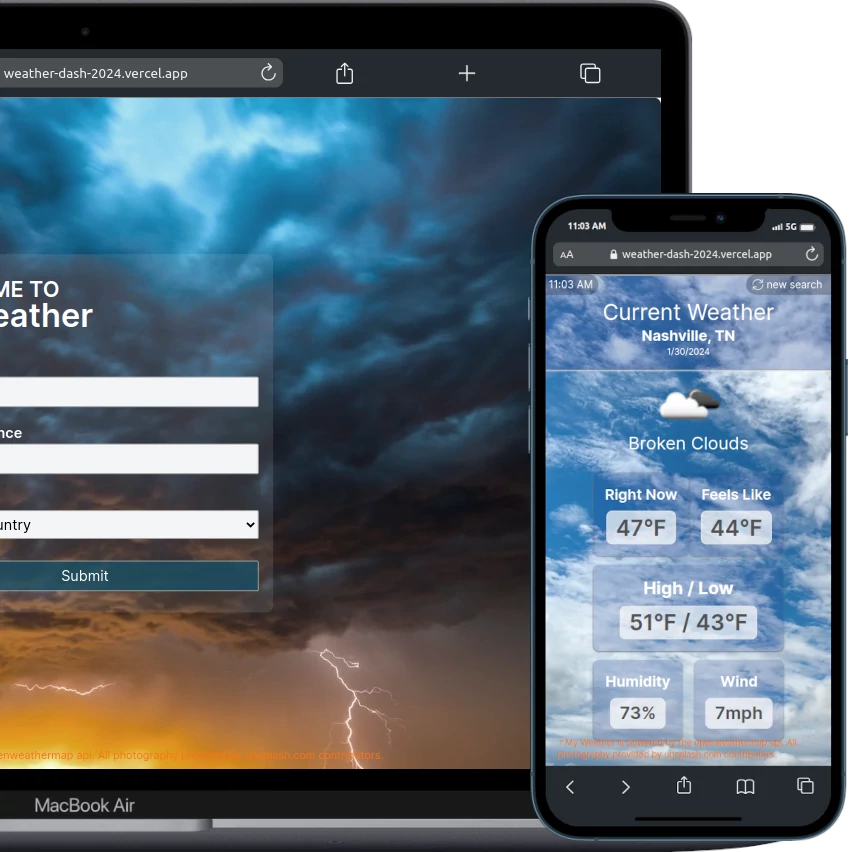

# MY WEATHER APP

### A Next.js application using the Open Weather Map API with data fetched using Server Side fetch API.

This application is a revisit to a challenge I had in bootcamp in 2022. I took the challenge and used it as a study project to utilize the new functionality of Next.js version 14. It uses SSR functionality and TailwindCSS, along with some advanced ES6 and JavaScript functions.

[Live Site](https://weather-dash-2024.vercel.app/)

### Contact

[wlowrimore@gmail.com](mailto://wlowrimore@gmail.com) 
[williamlowrimore.com](https://www.williamlowrimore) 
[LinkedIn](https://www.linkedin.com/in/william-lowrimore-dev)
